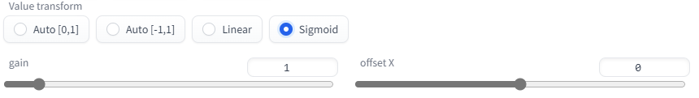

[English ver.](./README_en.md)

# Dump U-Net

## 目次

- [Dump U-Net](#dump-u-net)
  - [目次](#目次)
  - [これは何](#これは何)
  - [できること](#できること)
  - [特徴量の抽出](#特徴量の抽出)
    - [U-Net の特徴量画像](#u-net-の特徴量画像)
      - [画面説明](#画面説明)
      - [Colorization](#colorization)
      - [Dump Setting](#dump-setting)
      - [抽出画像の例](#抽出画像の例)
    - [アテンション層の特徴量抽出](#アテンション層の特徴量抽出)
      - [画面説明](#画面説明-1)
      - [例](#例)
  - [ブロックごとのプロンプトの変更](#ブロックごとのプロンプトの変更)
    - [概要](#概要)
    - [画面説明](#画面説明-2)
    - [記法](#記法)
    - [例](#例-1)
    - [Dynamic Prompts との併用](#dynamic-prompts-との併用)
  - [TODO](#todo)

## これは何

U-Net の特徴量を可視化するための [stable-diffusion-webui](https://github.com/AUTOMATIC1111/stable-diffusion-webui) の拡張です。

## できること

1. モデルの途中出力の可視化：U-Net の各ブロックおよびアテンション層の特徴量を可視化する。
2. 層別プロンプト：U-Net の各ブロックでプロンプトを変更しながら画像を生成する。
3. 2.でプロンプトを変更したときの U-Net の特徴量の差分を可視化する。

## 特徴量の抽出

例として以下の画像を使用する。


```
Model: waifu-diffusion-v1-3-float16 (84692140)
Prompt: a cute girl, pink hair
Sampling steps: 20
Sampling Method: DPM++ 2M Karras
Size: 512x512
CFG Scale: 7
Seed: 1719471015
```

### U-Net の特徴量画像

たとえば以下のような画像を生成する。

グレースケール出力 `OUT11, steps 20, Black/White, Sigmoid(1,0)`


カラー出力 `OUT11, steps 20, Custom, Sigmoid(1,0), H=(2+v)/3, S=1.0, V=0.5`


#### 画面説明


<dl>
<dt>Extract U-Net features</dt>
<dd>チェックすると U-Net の特徴量抽出が有効になる。</dd>
<dt>Layers</dt>
<dd>抽出対象のブロックを指定する。コンマ区切り、ハイフン区切りが使える。<code>IN11-M00-OUT00</code>は繋がっている。</dd>
<dt>Image saving steps</dt>
<dd>抽出対象のステップを指定する。</dd>
<dt>Colorization</dt>
<dd>出力画像の色を指定する。</dd>
<dt>Dump Setting</dt>
<dd>特徴量のバイナリを出力する設定を行う。</dd>
<dt>Selected Layer Info</dt>
<dd><code>Layers</code> で指定したブロックの詳細が出力される。</dd>
</dl>

抽出するブロックの指定方法：

```
単体指定： IN00
    IN00 から IN11、M00、OUT00 から OUT11 が使える。
複数指定： IN00, IN01, M00
    コンマ `,` で区切って複数のブロックを指定できる。
範囲指定： IN00-OUT11
    ハイフン `-` で区切って範囲を指定できる。
    両端は範囲に含まれる。
    IN11, M00, OUT00 は繋がっている。
範囲指定（ステップ付き）： IN00-OUT11(+2)
    範囲指定の後に `(+数字)` と書くとステップを表す。
    +1 と書くと通常の範囲指定と同じ。
    +2 と書くと一つ飛ばしで指定したことになる。
    例えば上記の例は
    IN00, IN02, IN04, IN06, IN08, IN10,
    M00,
    OUT01, OUT03, OUT05, OUT07, OUT09, OUT11
    を指定したことになる。
```

#### Colorization


<dl>
<dt>Colorize method</dt>
<dd>色付けの方法を指定する。<br/>
<code>White/Black</code> は特徴量を <code>v</code> として、<code>|v|</code> が大きいピクセルを白、小さいピクセルを黒で表示する。<br/>
<code>Red/Blue</code> は <code>v</code> が大きいピクセルを赤、小さいピクセルを青で表示する。</br>
<code>Custom</code> は <code>v</code> の値から RGB もしくは HSL 色空間の値を自由に計算する。</dd>
<dt>Value transform</dt>
<dd>特徴量の値は必ずしもそのまま色の指定に使える大きさではない。そのときにピクセル値へ変換するときの変換方法を指定する。<br/>
<code>Auto [0,1]</code> は与えられた特徴量の最小値と最大値を使って値を <code>[0,1]</code> に線型変換する。<br/>
<code>Auto [-1,1]</code> は同じく <code>[-1,1]</code> に線型変換する。<br/>
<code>Linear</code> は <code>Clamp min./max.</code> を指定して、その範囲を <code>Colorize method</code> が <code>White/Black</code> のとき <code>[0,1]</code> に、それ以外のとき <code>[-1,1]</code> に線型変換する。<br/><br/>
<code>Sigmoid</code> は <code>gain</code> と <code>offset</code> を指定して、<code>v + offset</code> を<a href="https://ja.wikipedia.org/wiki/%E3%82%B7%E3%82%B0%E3%83%A2%E3%82%A4%E3%83%89%E9%96%A2%E6%95%B0" target="_blank">シグモイド関数</a>で変換する。出力は <code>Colorize method</code> が <code>White/Black</code> のとき <code>[0,1]</code> に、それ以外のとき <code>[-1,1]</code> になる。<br/>
<dt>Color space</dt>
<dd><code>Value transform</code> で変換した値 <code>v</code> をピクセル値に変換するコードを書く。<code>v</code> の範囲は <code>Colorize method</code> および <code>Value transform</code> の指定により <code>[0,1]</code> もしくは <code>[-1,1]</code> で与えられる。計算結果は <code>[0,1]</code> でクリップされる。<br/>コードは <code>numpy</code> をグローバル環境として実行される。たとえば、<code>abs(v)</code> は <code>numpy.abs(v)</code> の意味になる。<br/></dd>
</dl>

#### Dump Setting


<dl>
<dt>Dump feature tensors to files</dt>
<dd>チェックすると U-Net の特徴量をファイルとして書き出す。</dd>
<dt>Output path</dt>
<dd>バイナリを出力するディレクトリを指定する。存在しなければ作成される。</dd>
</dl>

#### 抽出画像の例

左から順に、`steps=1,5,10` の画像。

- IN00 (64x64, 320ch)


- IN05 (32x32, 640ch)


- M00 (8x8, 1280ch)


- OUT06 (32x32, 640ch)


- OUT11 (64x64, 320ch)


### アテンション層の特徴量抽出

#### 画面説明


ほぼ [U-Net の特徴量画像](#41-u-net-%E3%81%AE%E7%89%B9%E5%BE%B4%E9%87%8F%E7%94%BB%E5%83%8F) と同じ。

#### 例

横軸がトークン位置を表す。最初に開始トークン、最後に終了トークンが挿入されているので、間の75枚の画像が各トークンの影響を表す。

縦軸はアテンション層のヘッド。今のモデルでは <code>h=8</code> なので画像が8つ並ぶことになる。

「`pink hair` はこの層に効いてるのかな？」みたいなことが分かる。

- IN01


- M00


- OUT10


## ブロックごとのプロンプトの変更

### 概要

内容は以下の記事を参照。

[Stable DiffusionのU-Netでブロックごとに異なるプロンプトを与えて画像生成する（ブロック別プロンプト）](https://note.com/kohya_ss/n/n93b7c01b0547)


```
Model: waifu-diffusion-v1-3-float16 (84692140)
Prompt: a (~: IN00-OUT11: cute; M00: excellent :~) girl
Sampling Method: Euler a
Size: 512x512
CFG Scale: 7
Seed: 3292581281
```

上の画像は順番に、

- `a cute girl` で生成した画像
- IN00 のみ cute を excellent に変更して生成した画像
- IN05 のみ cute を excellent に変更して生成した画像
- M00 のみ cute を excellent に変更して生成した画像

となっている。

### 画面説明


ほぼ [U-Net の特徴量画像](#41-u-net-%E3%81%AE%E7%89%B9%E5%BE%B4%E9%87%8F%E7%94%BB%E5%83%8F) と同じ。

<dl>
<dt>Output difference map of U-Net features between with and without Layer Prompt</dt>
<dd>ブロックごとのプロンプトが有効の時と無効の時の U-Net の特徴量を比較して差分画像を出力する。</dd>
</dl>

### 記法

プロンプト中で次に示す特殊な記法を用いることで、ブロックごとのプロンプトを指定できる。

```
a (~: IN00-OUT11: cute ; M00: excellent :~) girl
```

この場合、IN00～OUT11 まで（つまり全体）で

```
a  cute  girl
```

が使われるが、M00 のみ

```
a  excellent  girl
```

が使われることになる。

指定は `(~:` から `:~)` までの間で行う。書式は以下の通り。

```
(~:
    ブロック指定:プロンプト;
    ブロック指定:プロンプト;
    ...
    ブロック指定:プロンプト;
:~)
```

`(~:` の後、`:~)` の前、`:` の前、`;` の後は空白を入れてもいい。ただし `:プロンプト;` の部分の空白はそのまま結果に反映されるので注意。一番最後のプロンプトの後のセミコロンは無くてもいい。

ブロック指定は以下のように行う。おおむね X/Y plot と同じ。なお、範囲が重なっている場合は後に指定したものが優先される。

```
単体指定： IN00
    IN00 から IN11、M00、OUT00 から OUT11 が使える。
複数指定： IN00, IN01, M00
    コンマ `,` で区切って複数のブロックを指定できる。
範囲指定： IN00-OUT11
    ハイフン `-` で区切って範囲を指定できる。
    両端は範囲に含まれる。
    IN11, M00, OUT00 は繋がっている。
範囲指定（ステップ付き）： IN00-OUT11(+2)
    範囲指定の後に `(+数字)` と書くとステップを表す。
    +1 と書くと通常の範囲指定と同じ。
    +2 と書くと一つ飛ばしで指定したことになる。
    例えば上記の例は
    IN00, IN02, IN04, IN06, IN08, IN10,
    M00,
    OUT01, OUT03, OUT05, OUT07, OUT09, OUT11
    を指定したことになる。
その他全て: _ （アンダーバー）
    これは特殊な記号で、優先度は最も低い。
    他のどのブロックにも当てはまらなかった場合、ここで指定したプロンプトが使われる。
```

### 例

いくつか例を挙げる。

```
1: (~: IN00: A ; IN01: B :~)
2: (~: IN00: A ; IN01: B ; IN02: C :~)
3: (~: IN00: A ; IN01: B ; IN02: C ; _ : D :~)
4: (~: IN00,IN01: A ; M00 : B :~)
5: (~: IN00-OUT11: A ; M00 : B :~)
```

1: IN00でAを、IN01でBを使う。他のブロックでは何も無し。

2: IN00でAを、IN01でBを、IN02でCを使う。他のブロックでは何も無し。

3: IN00でAを、IN01でBを、IN02でCを使う。他のブロックではDを使う。

4: IN00とIN01でAを、M00でBを使う。他のブロックでは何も無し。

5: IN00からOUT11まで（つまり全体）でAを使う。ただしM00ではBを使う。

### Dynamic Prompts との併用

検証には [Dynamic Prompts](https://github.com/adieyal/sd-dynamic-prompts) との併用が便利。

たとえば1ブロックでのみプロンプトを変更した際の影響を見たい場合、Dynamic Prompts の Jinja Template を有効にして

```

  a cute school girl, pink hair, wide shot, (~:{{layer}}:bad anatomy:~)

```

と指定すると、各ブロックでの「bad anatomy」の効果を調べる……といったことができる。

実際の例：[ブロック別プロンプトで特定の1ブロックにプロンプトを追加してみるテスト](https://gist.github.com/hnmr293/7f240aa5b74c0f5a27a9764fdd9672e2)

## TODO

- セルフアテンション層の可視化