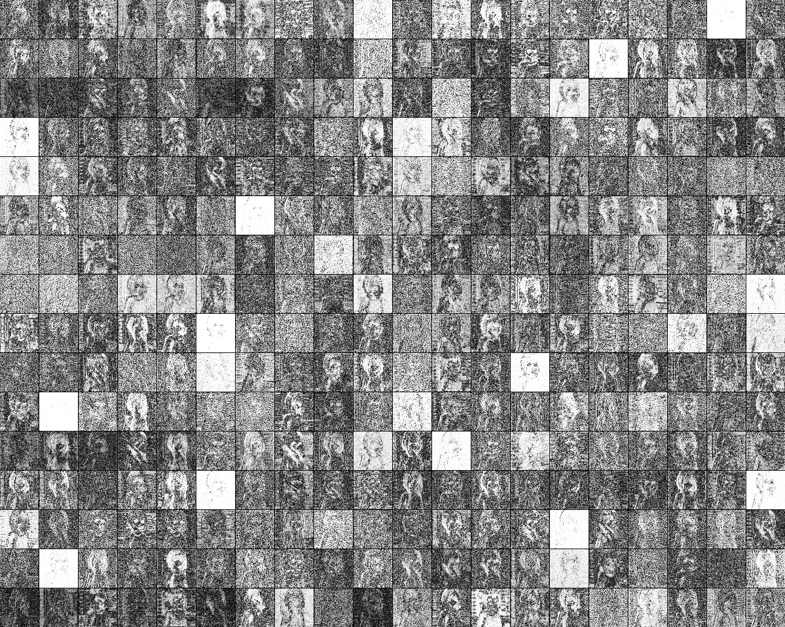
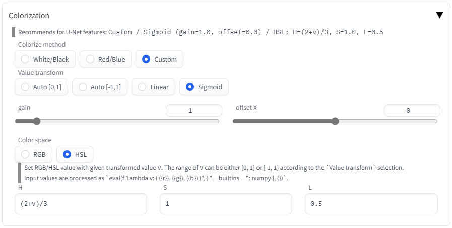
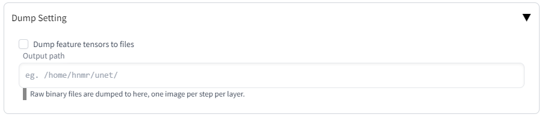
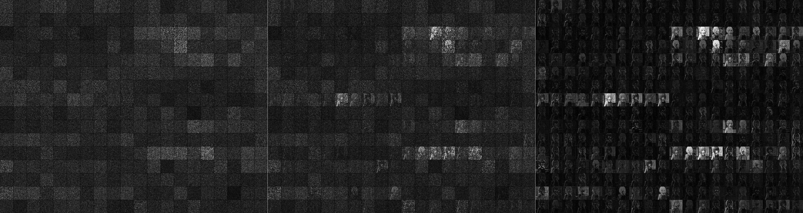
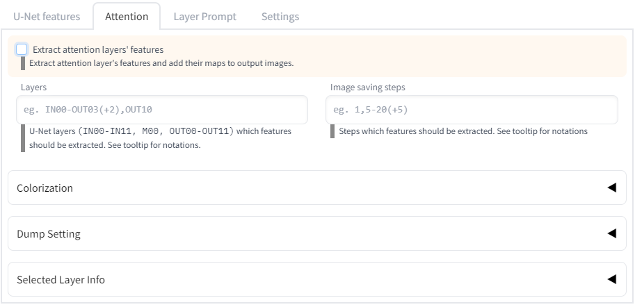
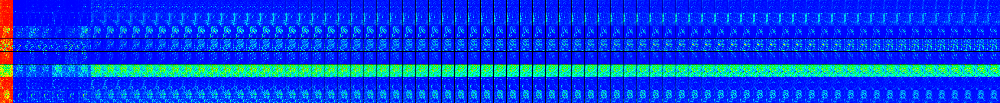
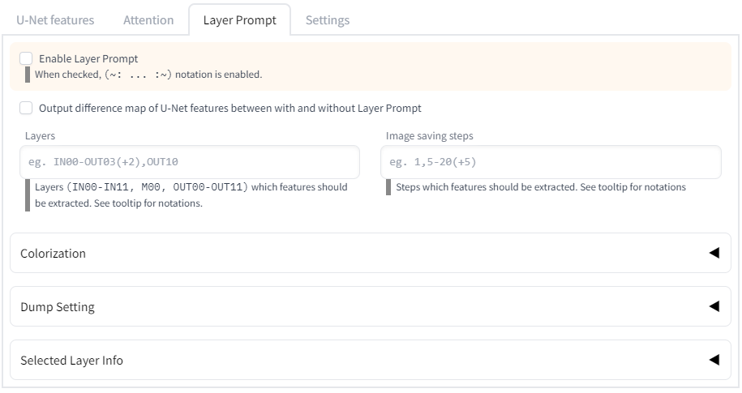

# Dump U-Net

## Table of contents

- [Dump U-Net](#dump-u-net)
  - [Table of contents](#table-of-contents)
  - [What is this](#what-is-this)
  - [What can this](#what-can-this)
  - [Feature extraction](#feature-extraction)
    - [Feature extraction from U-Net](#feature-extraction-from-u-net)
      - [UI description](#ui-description)
      - [Colorization](#colorization)
      - [Dump Setting](#dump-setting)
      - [Examples of extracted images](#examples-of-extracted-images)
    - [Feature extraction from Attention layer](#feature-extraction-from-attention-layer)
      - [UI description](#ui-description-1)
      - [Examples](#examples)
  - [Per-block Prompts](#per-block-prompts)
    - [Overview](#overview)
    - [UI description](#ui-description-2)
    - [Notation](#notation)
    - [Examples](#examples-1)
    - [Use with Dynamic Prompts](#use-with-dynamic-prompts)
  - [TODO](#todo)

## What is this

This is an extension for [stable-diffusion-webui](https://github.com/AUTOMATIC1111/stable-diffusion-webui) that adds a custom script which let you to observe U-Net feature maps.

## What can this

This extension can

1. visualize intermediate output of the model: features of each block of U-Net and attention layer.
2. per-block prompts: generate images changing the prompt in each block of U-Net.
3. visualize the difference of features in 2.

## Feature extraction

Use the image below as an example.


```
Model: waifu-diffusion-v1-3-float16 (84692140)
Prompt: a cute girl, pink hair
Sampling steps: 20
Sampling Method: DPM++ 2M Karras
Size: 512x512
CFG Scale: 7
Seed: 1719471015
```

### Feature extraction from U-Net

For example, the following images are generated.

Grayscale output `OUT11, steps 20, Black/White, Sigmoid(1,0)`


Colored output `OUT11, steps 20, Custom, Sigmoid(1,0), H=(2+v)/3, S=1.0, V=0.5`


#### UI description


<dl>
<dt>Extract U-Net features</dt>
<dd>If checked, U-Net feature extraction is enabled.</dd>
<dt>Layers</dt>
<dd>Specify blocks to be extracted. Comma delimiters and hyphen delimiters can be used. <code>IN11</code>, <code>M00</code> and <code>OUT00</code> are connected.</dd>
<dt>Image saving steps</dt>
<dd>Specify the steps processing extraction.</dd>
<dt>Colorization</dt>
<dd>Specify how colorize the output images.</dd>
<dt>Dump Setting</dt>
<dd>Configure "binary-dump" settings.</dd>
<dt>Selected Layer Info</dt>
<dd>Details of the block input/output specified in <code>Layer</code> section.</dd>
</dl>

In `Layer` section you can use the grammer below:

```
single block: IN00
    You can use IN00, IN01, ...,  IN11, M00, OUT00, OUT01 ..., OUT11.
multiple blocks: IN00, IN01, M00
    Comma separated block names.
range: IN00-OUT11
    Hyphen separated block names.
    Edges are included in the range.
    IN11, M00 and OUT00 are connected.
range with steps: IN00-OUT11(+2)
    `(+digits)` after the range defines steps.
    `+1` is same as normal range.
    `+2` means "every other block".
    For instance, `IN00-OUT11(+2)` means:
      IN00, IN02, IN04, IN06, IN08, IN10,
      M00,
      OUT01, OUT03, OUT05, OUT07, OUT09, OUT11
```

#### Colorization



<dl>
<dt>Colorize method</dt>
<dd>Specifies the colorization method.<br/>
Let <code>v</code> be the feature value.</br>
<code>White/Black</code> shows white pixel for large <code>|v|</code>, black pixel for small <code>|v|</code>.<br/>
<code>Red/Blue</code> shows red pixel for large <code>v</code>, blue pixel for small <code>|v|</code>.<br/>
<code>Custom</code> computes the color from <code>v</code>. You can use RGB or HSL colorspace.
</dd>
<dt>Value transform</dt>
<dd>
Feature values are not suitable to be used as-is to specify colors. This section specifies the conversion method from feature values to pixel values.<br/>
<code>Auto [0,1]</code> converts the value to <code>[0,1]</code> linearly using the minimum and maximum values of given feature values.<br/>
<code>Auto [-1,1]</code> converts the value to <code>[-1,1]</code> as well.<br/>
<code>Linear</code> first clamps feature values to specified <code>Clamp min./max.</code> range. Then linearly converts values to <code>[0,1]</code> when <code>Colorize method</code> is </code>White/Black</code> and to </code>[-1,1]</code> otherwise.<br/>
<br/>
<code>Sigmoid</code> is a <a href="https://en.wikipedia.org/wiki/Sigmoid_function" target="_blank">sigmoid function</a> with specified gain and x-offset. The output is in range <code>[0,1]</code> when <code>Colorize method</code> is <code>White/Black</code>, and <code>[-1,1]</code> otherwise.<br/>

</dd>
<dt>Color space</dt>
<dd>Write code to convert <code>v</code> transformed by <code>Value transform</code> to the pixel value, where <code>v</code> is given as <code>[0,1]</code> or <code>[-1,1]</code> according to <code>Colorize method</code> and <code>Value transform</code>. The result is clipped at <code>[0,1]</code>.<br/>
The code is executed with <code>numpy</code> module as the global environment. For example, <code>abs(v)</code> means <code>numpy.abs(v)</code>.<br/>

</dd>
</dl>

#### Dump Setting



<dl>
<dt>Dump feature tensors to files</dt>
<dd>If checked, U-Net feature tensors are exported as files.</dd>
<dt>Output path</dt>
<dd>Specify the directory to output binaries. If it does not exist, it will be created.</dd>
</dl>

#### Examples of extracted images

Images with `steps=1,5,10` from left to right.

- IN00 (64x64, 320ch)


- IN05 (32x32, 640ch)


- M00 (8x8, 1280ch)


- OUT06 (32x32, 640ch)


- OUT11 (64x64, 320ch)


### Feature extraction from Attention layer

#### UI description



Same as [Feature extraction from U-Net](#feature-extraction-from-u-net).

#### Examples

The horizontal axis represents the token position. The beginning token and ending token are inserted, so the 75 images in between represent the influence of each token.

The vertical axis represents the heads of the attention layer. In the current model, <code>h=8</code>, so there will be 8 images in a row.

"It seems `pink hair` is working on this layer..." Something like that can be seen.

- IN01


- M00


- OUT10


## Per-block Prompts

### Overview

See the following article for content (Japanese lang).

[Generating images with different prompts for each block in Stable Diffusion's U-Net (block-specific prompts)](https://note.com/kohya_ss/n/n93b7c01b0547)


```
Model: waifu-diffusion-v1-3-float16 (84692140)
Prompt: a (~: IN00-OUT11: cute; M00: excellent :~) girl
Sampling Method: Euler a
Size: 512x512
CFG Scale: 7
Seed: 3292581281
```

The above images are in order:

- generated by `a cute girl`.
- with cute changed to excellent in IN00
- with cute changed to excellent in IN05
- with cute changed to excellent in M00

### UI description



Same as [Feature extraction from U-Net](#feature-extraction-from-u-net)

<dl>
<dt>Output difference map of U-Net features between with and without Layer Prompt</dt>
<dd>Add outputs to an image which shows difference between per-block prompt disabled and enabled.</dd>
</dl>

### Notation

Use notation below in the prompt:

```
a (~: IN00-OUT11: cute ; M00: excellent :~) girl
```

In above case, IN00-OUT11 (i.e. whole generation process) use

```
a  cute  girl
```

but for M00

```
a  excellent  girl
```

You can specify per-block prompts with the grammer below:

```
(~:
    block-spec:prompt;
    block-spec:prompt;
    ...
    block-spec:prompt;
:~)
```

After `(~:`, before `:~)`, before `:`, and after `;`, you may insert spaces. Note that the `:prompt;` is reflected in the result as it is with spaces. The semicolon after the last prompt may be omitted.

The block specification (`block-spec` above) is as follows. Generally, it is the same as X/Y plot. If there are overlapping ranges, the later one takes precedence.

```
single block: IN00
    You can use IN00, IN01, ...,  IN11, M00, OUT00, OUT01 ..., OUT11.
multiple blocks: IN00, IN01, M00
    Comma separated block names.
range: IN00-OUT11
    Hyphen separated block names.
    Edges are included in the range.
    IN11, M00 and OUT00 are connected.
range with steps: IN00-OUT11(+2)
    `(+digits)` after the range defines steps.
    `+1` is same as normal range.
    `+2` means "every other block".
    For instance, `IN00-OUT11(+2)` means:
      IN00, IN02, IN04, IN06, IN08, IN10,
      M00,
      OUT01, OUT03, OUT05, OUT07, OUT09, OUT11
otherwise: _ (underbar)
    This is a special symbol and has the lowest precedence.
    If any other block specs are matched, the prompt defined here will be used.
```

### Examples

A few examaples.

```
1: (~: IN00: A ; IN01: B :~)
2: (~: IN00: A ; IN01: B ; IN02: C :~)
3: (~: IN00: A ; IN01: B ; IN02: C ; _ : D :~)
4: (~: IN00,IN01: A ; M00 : B :~)
5: (~: IN00-OUT11: A ; M00 : B :~)
```

1: use A in IN00, B in IN01, and nothing in other blocks.
2: use A in IN00, B in IN01, C in IN02 and nothing in other blocks.
3: use A in IN00, B in IN01, C in IN02 and D in other blocks.
4: use A in IN00 and IN01, B in M00, and nothing in other blocks.
5: use A in from IN00 to OUT11 (all blocks), but B for M00.

### Use with Dynamic Prompts

For experiments, [Dynamic Prompts](https://github.com/adieyal/sd-dynamic-prompts) is useful.

For instance, if you want to see the effect of changing the prompt in only one block, enable Jinja Template in Dynamic Prompts and input the following prompt:

```

  a cute school girl, pink hair, wide shot, (~:{{layer}}:bad anatomy:~)

```

to check the effect of `bad anatomy` in each block.

Actual examples are here (Japasese lang).

[Test adding prompts to one specific block with prompts by block](https://gist.github.com/hnmr293/7f240aa5b74c0f5a27a9764fdd9672e2)

## TODO

- visualize self-attention layer
- 