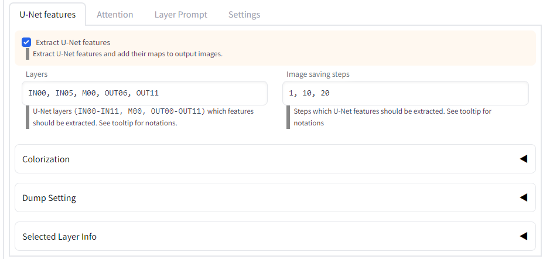

- [これは何](#これは何)
- [概略](#概略)
- [特徴量の抽出](#特徴量の抽出)
- [ブロックごとのプロンプトの変更](#ブロックごとのプロンプトの変更)
  - [Dynamic Prompts との併用](#dynamic-prompts-との併用)
- [差分の可視化](#差分の可視化)
- [TODO](#todo)

# これは何

U-Net の特徴量を可視化するための [stable-diffusion-webui](https://github.com/AUTOMATIC1111/stable-diffusion-webui) の拡張です。

# 概略

1. U-Net の各ブロックにおける特徴量を抽出し、ch ごとの画像として出力する。
2. U-Net の各ブロックでプロンプトを変更しながら画像を生成する。
3. 2.でプロンプトを変更したときの U-Net の特徴量の差分を可視化する。

# 特徴量の抽出



通常の出力画像：


```
Model: waifu-diffusion-v1-3-float16 (84692140)
Prompt: a cute girl, pink hair
Sampling Method: DPM++ 2M Karras
Size: 512x512
CFG Scale: 7
Seed: 1719471015
```

U-Net の特徴量画像：

特徴量を `v` として、`|v|` が大きいピクセルを白、小さいピクセルを黒で表示する。

- IN00 (64x64, 320ch)

step 1


step 10


step 20


- OUT02 (16x16, 1280ch)

step 20


- OUT11 (64x64, 320ch)

step 1


step 10


step 20


カラーマップモード:

絶対値を基にした白黒でなく、正の値を赤で、負の値を青で表す。ゼロに近いほど黒くなる。


# ブロックごとのプロンプトの変更


内容は以下の記事を参照。

[Stable DiffusionのU-Netでブロックごとに異なるプロンプトを与えて画像生成する（ブロック別プロンプト）](https://note.com/kohya_ss/n/n93b7c01b0547)


```
Model: waifu-diffusion-v1-3-float16 (84692140)
Prompt: a (~: IN00-OUT11: cute: M00: excellent :~) girl
Sampling Method: Euler a
Size: 512x512
CFG Scale: 7
Seed: 3292581281
```

上の画像は順番に、

- `a cute girl` で生成した画像
- IN00 のみ cute を excellent に変更して生成した画像
- IN05 のみ cute を excellent に変更して生成した画像
- M00 のみ cute を excellent に変更して生成した画像

となっている。

プロンプト中で次に示す特殊な記法を用いることで、ブロックごとのプロンプトを指定できる。

```
a (~: IN00-OUT11: cute ; M00: excellent :~) girl
```

この場合、IN00～OUT11 まで（つまり全体）で

```
a  cute  girl
```

が使われるが、M00 のみ

```
a  excellent  girl
```

が使われることになる。

指定は `(~:` から `:~)` までの間で行う。書式は以下の通り。

```
(~:
    ブロック指定:プロンプト;
    ブロック指定:プロンプト;
    ...
    ブロック指定:プロンプト;
:~)
```

`(~:` の後、`:~)` の前、`:` の前、`;` の後は空白を入れてもいい。ただし `:プロンプト;` の部分の空白はそのまま結果に反映されるので注意。一番最後のプロンプトの後のセミコロンは無くてもいい。

ブロック指定は以下のように行う。おおむね X/Y plot と同じ。なお、範囲が重なっている場合は後に指定したものが優先される。

```
単体指定： IN00
    IN00 から IN11、M00、OUT00 から OUT11 が使える。
複数指定： IN00, IN01, M00
    コンマ `,` で区切って複数のブロックを指定できる。
範囲指定： IN00-OUT11
    ハイフン `-` で区切って範囲を指定できる。
    両端は範囲に含まれる。
    IN11, M00, OUT00 は繋がっている。
範囲指定（ステップ付き）： IN00-OUT11(+2)
    範囲指定の後に `(+数字)` と書くとステップを表す。
    +1 と書くと通常の範囲指定と同じ。
    +2 と書くと一つ飛ばしで指定したことになる。
    例えば上記の例は
    IN00, IN02, IN04, IN06, IN08, IN10,
    M00,
    OUT01, OUT03, OUT05, OUT07, OUT09, OUT11
    を指定したことになる。
その他全て: _ （アンダーバー）
    これは特殊な記号で、優先度は最も低い。
    他のどのブロックにも当てはまらなかった場合、ここで指定したプロンプトが使われる。
```

いくつか例を挙げる。

```
1: (~: IN00: A ; IN01: B :~)
2: (~: IN00: A ; IN01: B ; IN02: C :~)
3: (~: IN00: A ; IN01: B ; IN02: C ; _ : D :~)
4: (~: IN00,IN01: A ; M00 : B :~)
5: (~: IN00-OUT11: A ; M00 : B :~)
```

1: IN00でAを、IN01でBを使う。他のブロックでは何も無し。

2: IN00でAを、IN01でBを、IN02でCを使う。他のブロックでは何も無し。

3: IN00でAを、IN01でBを、IN02でCを使う。他のブロックではDを使う。

4: IN00とIN01でAを、M00でBを使う。他のブロックでは何も無し。

5: IN00からOUT11まで（つまり全体）でAを使う。ただしM00ではBを使う。

## Dynamic Prompts との併用

検証には [Dynamic Prompts](https://github.com/adieyal/sd-dynamic-prompts) との併用が便利。

たとえば1ブロックでのみプロンプトを変更した際の影響を見たい場合、Dynamic Prompts の Jinja Template を有効にして

```

  a cute school girl, pink hair, wide shot, (~:{{layer}}:bad anatomy:~)

```

と指定すると、各ブロックでの「bad anatomy」の効果を調べる……といったことができる。

実際の例：[ブロック別プロンプトで特定の1ブロックにプロンプトを追加してみるテスト](https://gist.github.com/hnmr293/7f240aa5b74c0f5a27a9764fdd9672e2)

# 差分の可視化

`Layer Prompt` タブの `Output difference map of U-Net features between with and without Layer Prompt` をオンにすると、ブロックごとのプロンプトを使った場合と使わない場合で U-Net の特徴量にどのような差があるかを可視化した画像を生成する。

可視化する層とステップ数は `U-Net features` タブで指定する。

（書きかけ）

# TODO

- 1.特徴量の抽出の画面説明
- 差分の可視化についてもうちょっと書く
